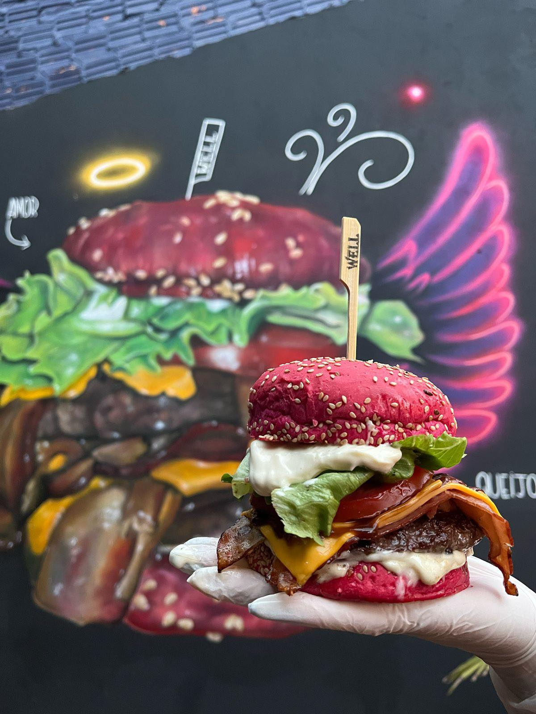

# Well Hamburgueria



Landing page institucional da Well Hamburgueria, desenvolvida em React + Vite para apresentar a marca, contar sua historia, destacar as unidades e facilitar o acesso a pedidos e contato.

## Projeto

Este site foi estruturado para comunicar a identidade da Well de forma emocional e comercial ao mesmo tempo:

- apresentar a proposta visual e o posicionamento da marca
- contar a historia da Well e de Vanessa Cirne
- destacar as unidades ativas e seus canais de atendimento
- levar o usuario com rapidez para WhatsApp, mapas e pedidos online

## Destaques

- pagina inicial com proposta visual forte e foco em conversao
- pagina de historia da marca com narrativa institucional
- dados centralizados das unidades em `src/data/site.ts`
- integracoes com WhatsApp, Instagram, Google Maps e links de pedido
- base pronta para evolucao de SEO, analytics e novas paginas

## Stack

- React 18
- TypeScript
- Vite
- React Router DOM

## Estrutura principal

```text
src/
  components/   Componentes reutilizaveis
  data/         Conteudo institucional e dados das unidades
  lib/          Utilitarios
  pages/        Paginas principais
  styles/       Estilos globais e por pagina
public/
  assets/       Imagens publicas do site
```

## Como rodar localmente

```bash
npm install
npm run dev
```

O Vite iniciara um servidor local para desenvolvimento.

## Scripts

```bash
npm run dev
npm run build
npm run preview
```

## Build de producao

```bash
npm run build
```

Os arquivos finais serao gerados na pasta `dist/`.

## Deploy

Este projeto pode ser publicado facilmente em plataformas estaticas como:

- Vercel
- Netlify
- GitHub Pages

Fluxo recomendado:

1. instalar dependencias com `npm install`
2. gerar a build com `npm run build`
3. publicar o conteudo da pasta `dist/`

## Informacoes de negocio

Atualmente o projeto inclui conteudo e links para:

- Unidade Lami
- Unidade Campo Belo - Hipica
- Unidade Itapua

Tambem inclui navegacao para:

- WhatsApp
- Instagram
- Google Maps
- pedidos online

## Repositorio

GitHub:

`https://github.com/AscendTechGlobal/well-hamburgueria`

